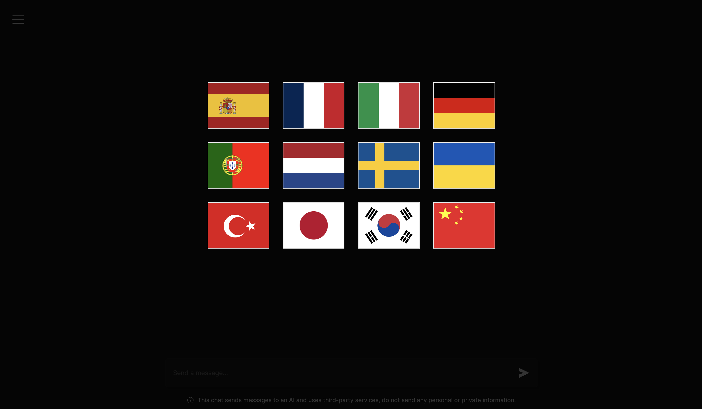
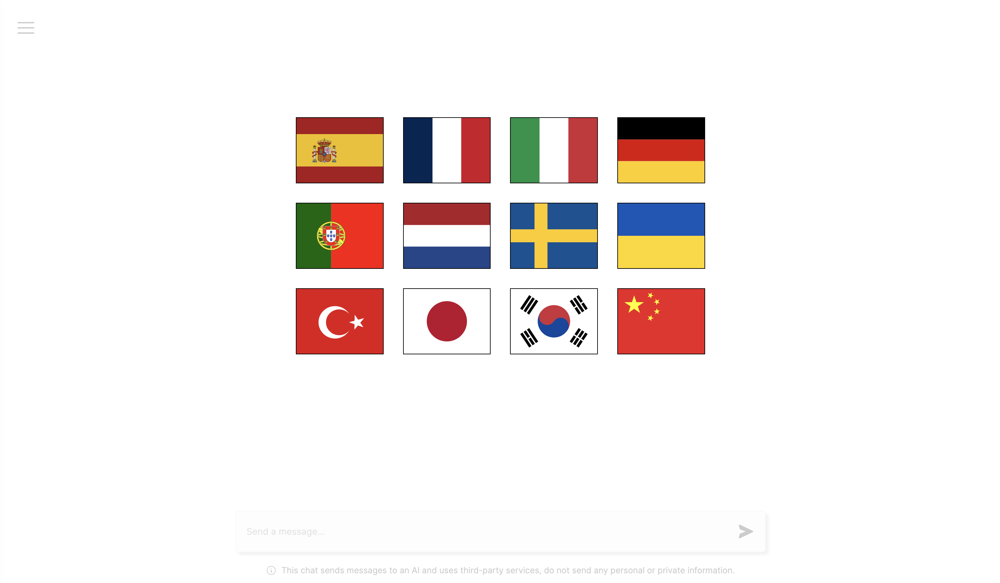
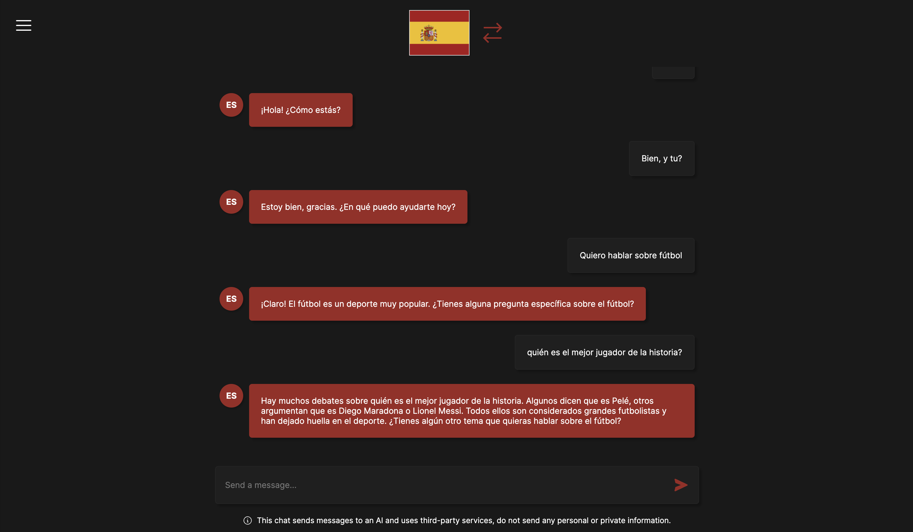
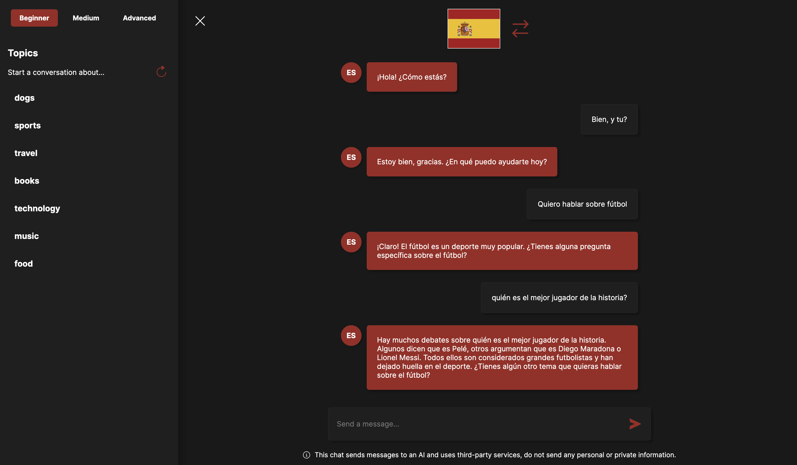
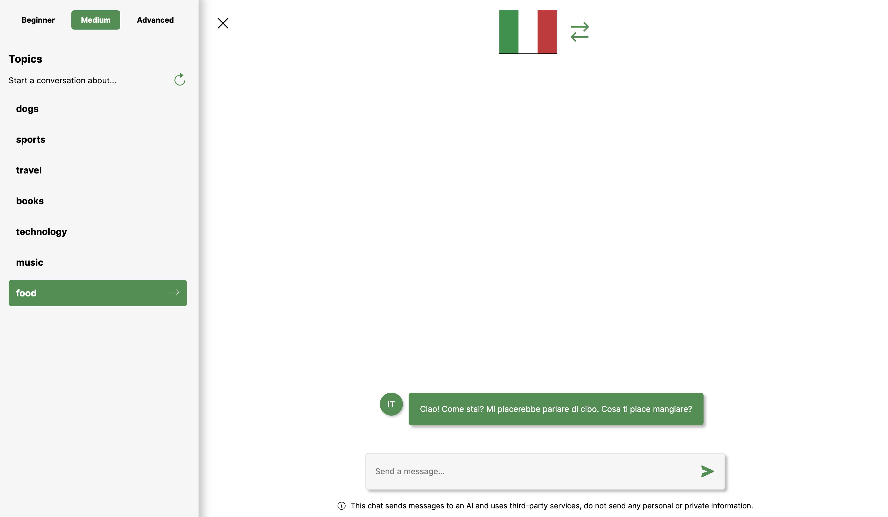
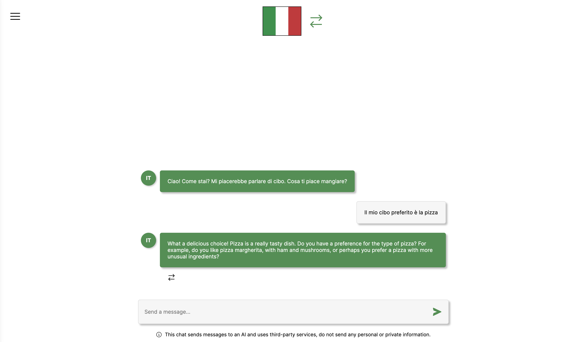

# Language Chat

**Choose the language**

  
&nbsp; &nbsp; &nbsp; &nbsp;
  

**Have a conversation**

  
&nbsp; &nbsp; &nbsp; &nbsp;
  

**Select a topic of conversation**

  
&nbsp; &nbsp; &nbsp; &nbsp;
  

